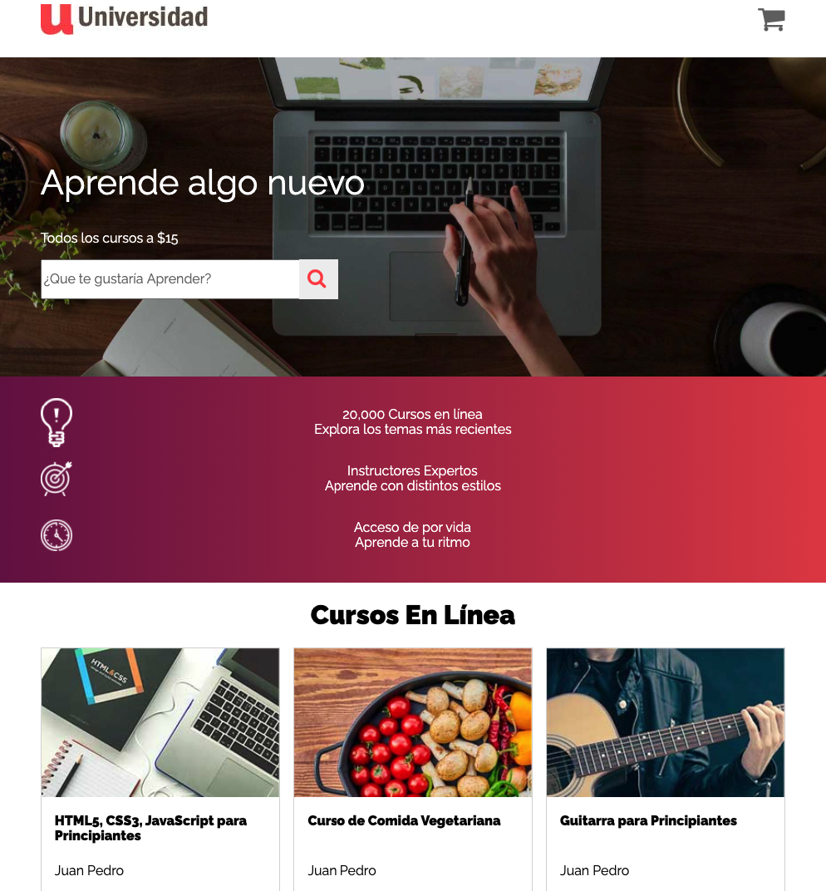
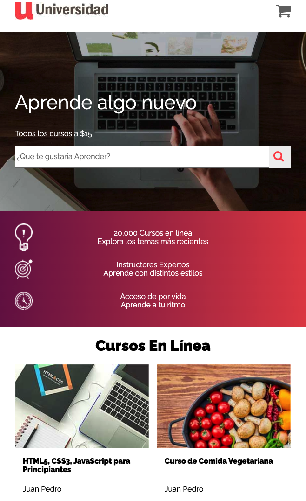

# University with Gulp

#### Screenshots

<p align="center">
  <kbd>
    
  </kbd>
</p>

<p align="center">
  <kbd>
    
  </kbd>
</p>

<p align="center">
  <kbd>
    
  </kbd>
</p>

#### Installs

With `package.json` and dependencies
```shell
docker-compose run app yarn
```

Without dependencies
```shell
docker-compose run app yarn add gulp gulp-cli gulp-sass gulp-autoprefixer --dev
```

#### Setup `package.json`
```json
...
  "browserslist": [
    "> 1%",
    "last 2 versions"
  ]
...
```

### Project structure

> run `tree -I "node_modules|screenshots"`
```shell
.
├── Dockerfile
├── README.md
├── css
│   └── app.css
├── docker-compose.yml
├── gulpfile.js
├── img
│   ├── cart.png
│   ├── curso1.jpg
│   ├── curso2.jpg
│   ├── curso3.jpg
│   ├── curso4.jpg
│   ├── curso5.jpg
│   ├── estrellas.png
│   ├── hero.jpg
│   ├── icono1.png
│   ├── icono2.png
│   ├── icono3.png
│   ├── logo.jpg
│   └── lupa.png
├── index.html
├── package.json
├── scss
│   ├── _custom.scss
│   ├── _mixins.scss
│   ├── _variables.scss
│   └── app.scss
└── yarn.lock

3 directories, 25 files
```

#### Gulp watch
```shell
docker-compose run app yarn watch
```

